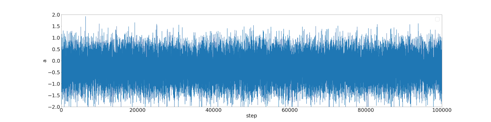

# stanz

[](https://travis-ci.org/sdual/stanz)

Stanz is a scala library for purely functional Bayesian analysis.

## Example

```scala
import com.github.sdual.stanz.Stanz._
import com.github.sdual.stanz.algorithm.{MetropolisHastings, MetropolisHastingsImpl}
import com.github.sdual.stanz.monad.Distribution

val mh: MetropolisHastings = MetropolisHastingsImpl()
val r = new Random
val n = 100000

val ps: Distribution[(Double, Double)] = points(createTrainingData(), linear())

val sampled = mh.run(n, ps).sample(r)
```




## References
1. [Practical Probabilistic Programming with Monads](http://mlg.eng.cam.ac.uk/pub/pdf/SciGhaGor15.pdf)
1. [FUNCTIONAL PEARLS Probabilistic Functional Programming in Haskell](https://web.engr.oregonstate.edu/~erwig/papers/PFP_JFP06.pdf)
